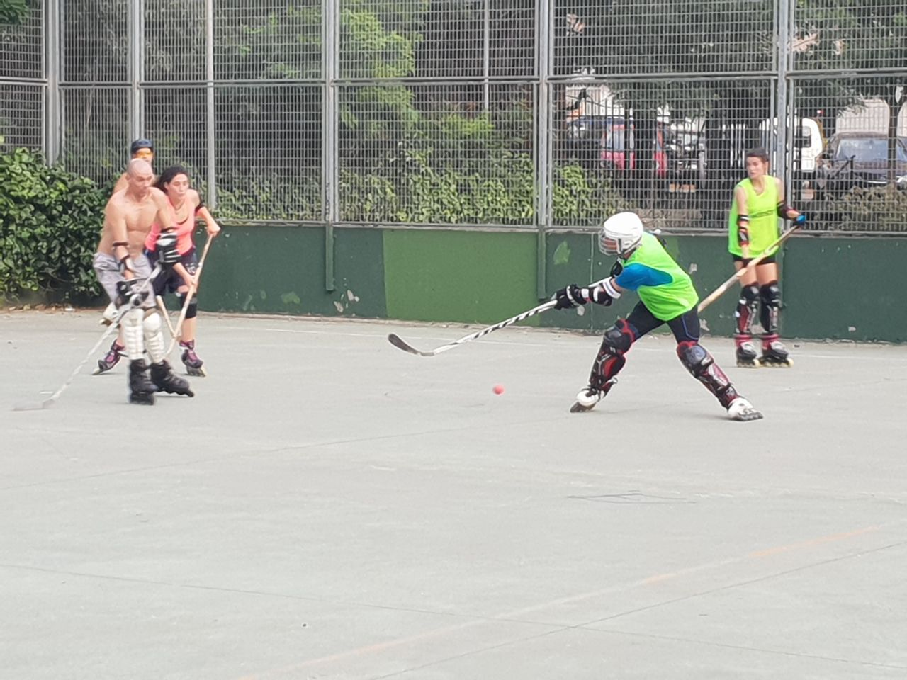
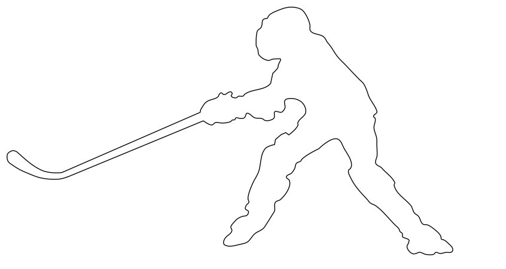
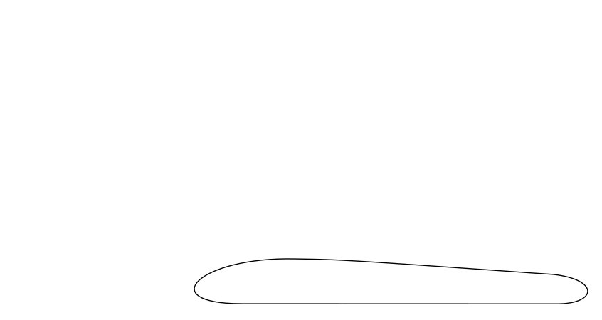
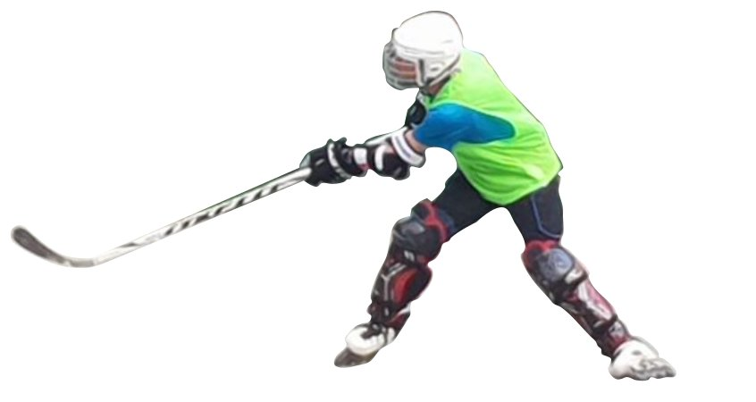
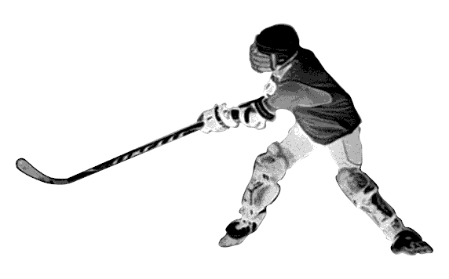
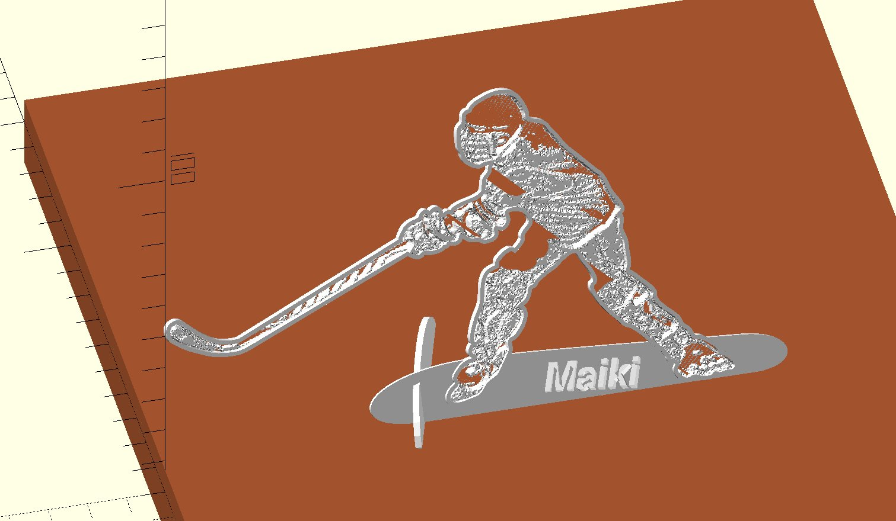
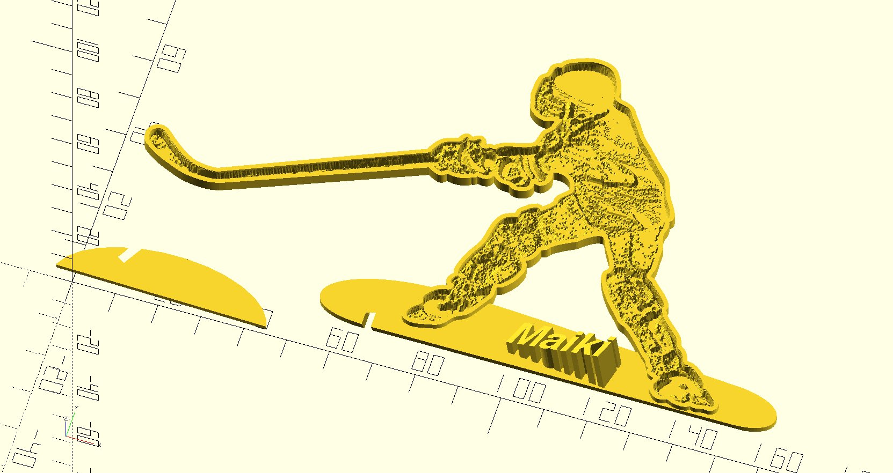
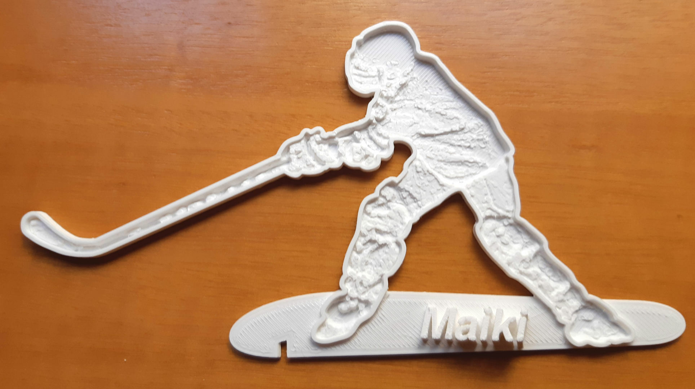
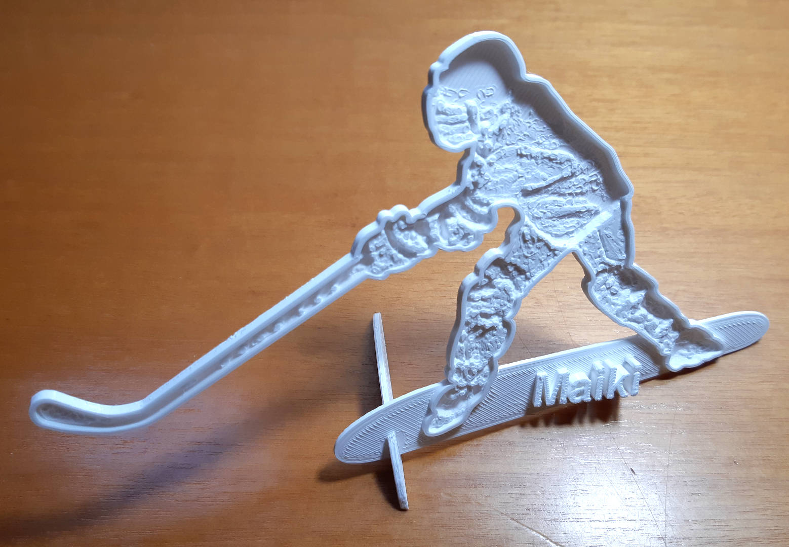
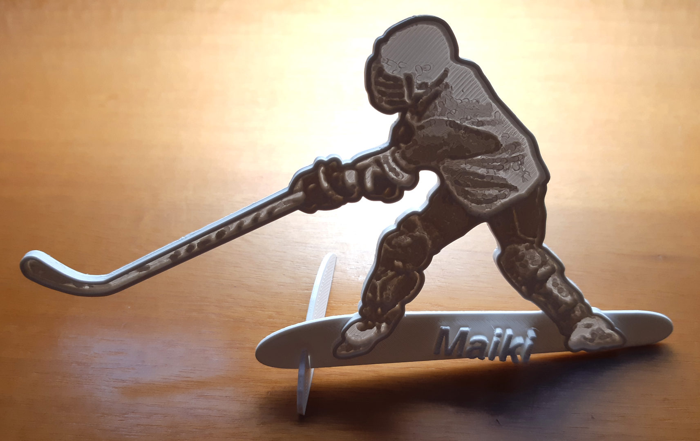

# Litophane of a hockey player

2020-JAN-29, _Samuel M.H._

## Introduction
It was a hot summer afternoon playing inline hockey in the local court and some photos were taken.

One of them took my attention, not because it was awesome or the play led to an epic goal, but for the pose of a player. If you watch carefully, he even didn't hit the ball!

Nevertheless, the pose is good enough to make something cool, a shaped [lithophane](https://en.wikipedia.org/wiki/Lithophane)!

## Process

### Design
The very first step is to delimitate precisely the idea, in this case a shaped lithophane stand-up flat sculpture. Yeah!

These  are the steps:

#### 1 Get the shape
The first thing is to cut the shape of the player. I did it with [Inkscape](https://inkscape.org/es/) using [Bézier curves](https://en.wikipedia.org/wiki/B%C3%A9zier_curve). This will give us the basic shape of the sculpture.

#### 2 Define the base
The shape alone is a bit dull, so some kind of base will be needed. This base will simulate the floor/shadow with a curved shape.

#### 3 Create the surface
With the shape, I cut the image to make the lithophane.

However, a lithophane is a gradient image, like a grayscale so I have to apply several modifications. I did it with the [GIMP](https://www.gimp.org/) image manipulation program.

1. Convert the image to a [grayscale](https://en.wikipedia.org/wiki/Grayscale).
1. [Equalize](https://en.wikipedia.org/wiki/Histogram_equalization) the colors, so from white to black they are evenly distributed.
1. Adjust the brigthness/contrast levels to make the image more appeling.
1. Invert the colours
1. [Posterize](https://en.wikipedia.org/wiki/Posterization) the image. I decided 8 levels of gray would be enough.

And this is the result.

_**Note:** this black and white image is interpreted by OpenScad as a surface. Lets say a pure black pixel is a cube of height=8 and a pure white pixel is a cube of height=0 (no cube = full light can pass = white). That is why I inverted the original colors._

#### 4 Mix all the parts
So having all this things in my mind, I mix all the concepts in my beloved [OpenScad](https://www.openscad.org/).

A lithophane with a bezel around it and some extras:
* The name of the hockey player.
* Another piece to keep the sculpture vertical.
* Some angulation to the pieces to make them more dynamic.

This is the presentation view, what it would look like on a desk. It corresponds to the `view_all()` module.

This is the final product.  It corresponds to the `final_pieces()` module.

We are ready to print!

### Build
Here are my printing params:
* Slicer: [Cura](https://ultimaker.com/es/software/ultimaker-cura)
* Printer: Creality Ender 3 Pro
* Layer height: 0.12mm
* Material: PLA, Winkle glaciar white
* Temperature: 200ºC
* Printing speed: 40 mm/s

These are the pieces

### Final result

This is the assembled final model.

This  model when the light comes from behind. It is possible to see the lithophane and the effect is awesome.

_Thank you Maiki for supporting the hockey scene so many time! It wouldn't have been possible without you. I wish you to keep on skating and playing for many years._

_Samuel M.H._

## Resources
* [OpenScad file](lithophane_maiki.scad)
* [STL file](lithophane_maiki.stl)
* [SVG project](resources/project.svg)
