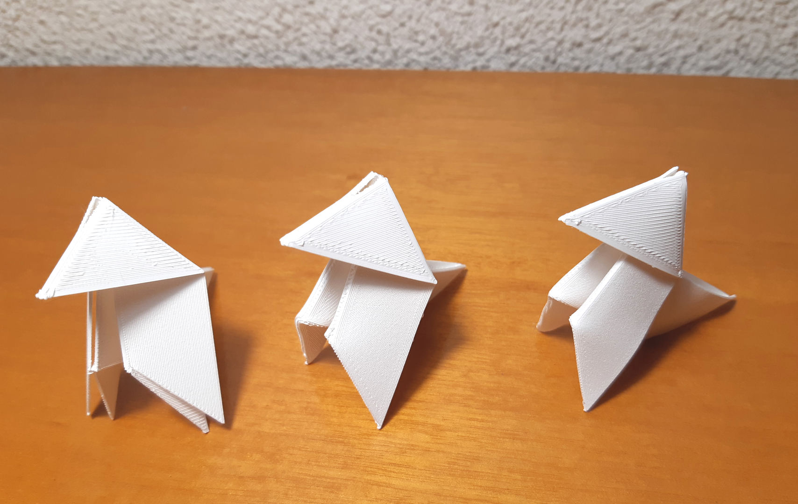

# Paper bird (classic)

2020-JAN-25, _Samuel M.H._

## Introduction
One of the very first things I like to do when I work with a new "flexible" material is to bend it into some origami figure. The paper bird could be considered the equivalent of the [hello world program](https://en.wikipedia.org/wiki/%22Hello,_World!%22_program), it is rather simple and enough to test some  craftsmanship abilities.

I will show you how to build your 3d printed an folded PLA bird.

## Process

### Design
The very first step is knowing how to make an actual paper bird. Once you have your paper figure, unfold it and notice some things:

1. All the folds are either horizontal, vertical or diagonal (0º, 90º, 45º, 135º).
1. The sheet can be represented as a 4x4 tile.
1. Not all the folds are required to build the figure, some are just the result of the building process and have no impact on the final result.
1. There are no double folds. If you perform all the folds at once, you get the final figure.

In the next image I show the actual folds required, a dashed line represents a downward fold and the solid line represents an upward fold.

Once the idea is clear, I translate the design into my beloved OpenScad. The key in this project is to control the printing process, so you have to know the layer height you are going to use. As the project is parametrized, this is not a big issue if your configuration does not match mine. You can experiment with the following parameters:
* PAPER_SIDE: size of the paper.
* LH: layer height.
* LAYERS: numbers of layer to build the paper.
* LAYERS_FOLD: the depth (in layers) of the fold.

I also use the module `extrude_line` which extrudes a polygon from point A to point B. It is part of [my OpenScad library](https://github.com/samuelmh/3dprint-lib_pocs).

This is the top view with the downward folds.

This is the bottom view with the upward folds.

### Build
Remember to match the slicer settings (layer height) with the OpenScad model (LH param).

Another important thing is to rotate the object so the extrusion lines are not aligned with any fold, therefore the plastic should bend and not to split. I rotated 30º the sheet.

This is the final print.

Note that no extruded line is aligned with any fold.

This is a comparison between the paper sheet (left) and the plastic one (right).

### Fold
This step is crucial to get a good result. The idea is to bend the plastic so it will make a linear fold through the space between layer we designed. As in my experience PLA when cold is very brittle, I encourage to heat the plastic with a hair dryer in order to make if flexible.

Beware of heating too much the piece as it will warp and willlose the folded paper efect becoming a melted plastic effect.

This is an induced downward fold. Note the warping on the left side of the piece due to an excess of heat.

This is the final result. The previus warping is reflected on the wing of the bird.

## Insights
These are some models I built to test some parameters.

Left piece:
* Layers: 5
* Fold depth: 2
* Layer height: 0.12mm
* As it was cold bended, there is no warping, the paper effect is optimal, but it splitted.

Center piece:
* Layers: 6
* Fold depth: 2
* Layer height: 0.2mm
* It was hot folded and the result is good, it is a sturdy piece but it looks like plastic

Right piece:
* This tutorial piece! The best balance between the paper-effect and resistance.

Another problem is the split on the top of the head of the bird. It is the widest fold with 6 pieces and I have not been able to avoid it. Maybe using less layers and more heat could soften it.

Enjoy and make your own figures!

_Samuel M.H._

## Resources
* [OpenScad file](paper_bird.scad)
* [STL file](paper_bird.stl)
* [Cura project file](paper_bird.3mf)
* [OpenScad SMH Library](https://github.com/samuelmh/3dprint-lib_pocs)
